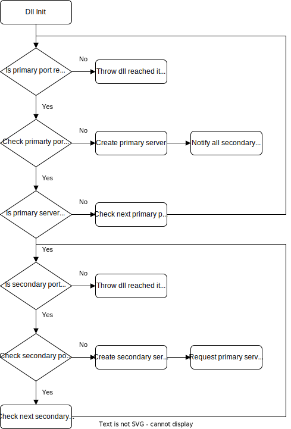

# CommunicationIPC
## _The Shared Library Sample_

This sample is using for Shared Library to simulate multiple APs using the same DLL and how they communicate.

## Primary Server
- Records all port infomation.
- Notify all port information to sercondary servers

## Secondary Servers
- Request all port information to Primary Server 

## Server Create Flow Chart

